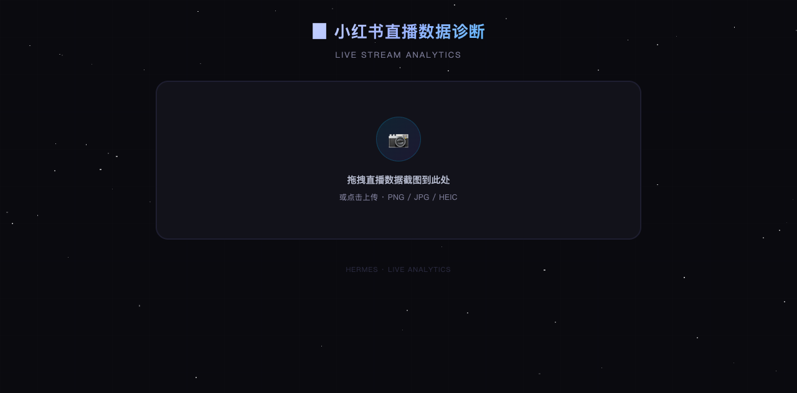

# 🚀 小红书直播数据诊断工具

> 上传直播数据截图，秒出诊断报告 —— 专为小红书直播运营打造

## 💡 为什么做这个

小红书直播运营每天下播第一件事：打开后台，盯着一堆数字——观看多少？成交多少？转化率掉了没？流量从哪来的？新粉占比够不够？

数据都在后台摆着，但要自己**手动算转化率、拆漏斗、对比趋势**，一场直播复盘动不动半小时起步。很多中小直播间根本没有专人做数据分析，主播本人下播已经累瘫，哪有精力再拉 Excel。

这个工具就是干这件事的——**上传一张直播后台截图，自动出诊断报告**。不用算、不用写、不用学，拖进去点一下就行。

> 让国内直播运营（尤其是小红书运营）省下复盘的时间，去做更有价值的事。

## ✨ 功能

- 📸 **截图上传** — 拖拽或点击上传直播间数据截图
- 📊 **对照填表** — 边看图边填数，不会漏项
- 🔍 **智能诊断** — 自动分析观看/成交/互动/留存/流量来源
- 📈 **漏斗分析** — 曝光→观看→成交 全链路转化率
- 🎯 **优化建议** — 5 个维度针对性提升方案
- 🆕 **新手扶持期判断** — 自动识别是否享受流量扶持
- 🏷️ **价格带结构分析** — 识别低价引流/主力/高价位表现
- 🌌 **科技感界面** — 星空粒子背景 + 毛玻璃卡片

## 🚀 使用方式

1. 下载 `index.html`
2. 双击用浏览器打开
3. 拖入直播数据后台截图
4. 对照截图填写数据
5. 点击「开始诊断」

> ⚠️ 纯前端工具，所有数据在本地浏览器处理，不上传任何服务器。

## 📸 截图说明

支持小红书直播后台数据截图，包含以下信息最佳：

- 观看人数 / 成交单数 / 成交金额
- 互动数据（点赞/评论/分享）
- 流量来源分布
- 观众画像

## 🛠 技术栈

纯 HTML + CSS + JavaScript，零依赖，双击即用。
